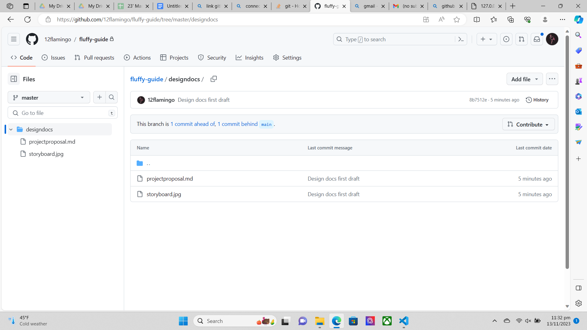

Untitled Goose Game Lite
# Project Description [2.5 pts]
> The name of the term project and a short description of what it will be.

**Project title**: Untitled Goose Game Lite

**Description**: Players navigate a 2D world as a mischievous goose. The gameplay involves interacting with the surroundings by shaking trees, consuming apples, and getting into trouble with humans.

# Similar projects [2.5 pts] 
> A 1-2 paragraph analysis of similar projects you've seen online, and how your project will be similar or different to those.

This project is modeled after the Untitled Goose Game, a puzzle stealth game where players take on the role of a goose. The goose is allowed to roam the village and the objective is to inconvenience the villagers by honking at them, stealing their belongings, or otherwise disrupting their routines. Similar to the original version, my game will involve the goose being free to explore the village and interact with its surrounding. 

It is distinct from the original in that his environment is autogenerated and may look different each time it is played, or as he roams around. Furthermore, it will be created in 2D rather than 2.5D in order to feasibly complete the project in time. 


# Structural Plan [2.5 pts]
> A structural plan for how the finalized project will be organized in different functions, files and/or classes.
1) Object oriented programming (objects in ```objects.py```)
* Goose object: Attributes include size (expand as he eats)
* Tree object: Attributes include: isSwaying (if goose bumps into it), hasApple
* Person class
2) Key functions
* ```goose.py```: Functions for goose include pickUpObject, walk, honk
* ```map.py```: Functions for generation of map
* Seperate file(s) for other functions like collision detection with other objects and villagers' movement


# Algorithmic Plan [2.5 pts]
> A plan for how you will approach the trickiest part of the project. Be sure to clearly highlight which part(s) of your project are algorithmically most difficult, and include some details of how you expect to implement these features.

1) Autogeneration of map: Pick random coordinates for objects and avoid generating objects on top of each other. Also, store the layout of a certain area surrounding a goose. Generate more objects as goose moves. (up/down/left/right)
2) **Collision detection** to allow goose to pick up/bump into objects: Measure distance between goose and object

# Timeline Plan [2.5 pts]
> A timeline for when you intend to complete the major features of the project.

<!--- https://www.tablesgenerator.com/markdown_tables --->

| Consult/Date | Features completed                                                    |
|--------------|-----------------------------------------------------------------------|
| TP0 (17 Nov) | Goose able to honk and walk                                         |
| TP1 (24 Nov) | Autogeneration of map, Goose able to bump into and pick up objects |
| TP2 (30 Dec) | Finish any other features,Graphics 50% done                       |
| TP3 (6 Dec)  | Graphics 100% done                                                  |
# Version Control Plan [1.5 pts]
> A short description and image demonstrating how you are using version control to back up your code

Code will be backed up in a private Github repo.



# Module List [1 pts]: 
> A list of all external modules/hardware/technologies you are planning to use in your project. Note that any such modules must be approved by a tech demo. If you are not planning to use any additional modules, that's okay, just say so!

No external modules will be used.

# Project Updates
## TP1 Update
None
## TP2 Update
None
## TP3 Update
Add the lady chasing goose and more trees